---
## Front matter
title: "ОТЧЕТ ПО ЛАБОРАТОРНОЙ РАБОТЕ №3"
subtitle: "Дисциплина: Архитектура компьютера"
author: "Обрезкова Анастасия Владимировна"

## Generic otions
lang: ru-RU
toc-title: "Содержание"

## Bibliography
bibliography: bib/cite.bib
csl: pandoc/csl/gost-r-7-0-5-2008-numeric.csl

## Pdf output format
toc: true # Table of contents
toc-depth: 2
lof: true # List of figures
lot: true # List of tables
fontsize: 12pt
linestretch: 1.5
papersize: a4
documentclass: scrreprt
## I18n polyglossia
polyglossia-lang:
  name: russian
  options:
	- spelling=modern
	- babelshorthands=true
polyglossia-otherlangs:
  name: english
## I18n babel
babel-lang: russian
babel-otherlangs: english
## Fonts
mainfont: PT Serif
romanfont: PT Serif
sansfont: PT Sans
monofont: PT Mono
mainfontoptions: Ligatures=TeX
romanfontoptions: Ligatures=TeX
sansfontoptions: Ligatures=TeX,Scale=MatchLowercase
monofontoptions: Scale=MatchLowercase,Scale=0.9
## Biblatex
biblatex: true
biblio-style: "gost-numeric"
biblatexoptions:
  - parentracker=true
  - backend=biber
  - hyperref=auto
  - language=auto
  - autolang=other*
  - citestyle=gost-numeric
## Pandoc-crossref LaTeX customization
figureTitle: "Рис."
tableTitle: "Таблица"
listingTitle: "Листинг"
lofTitle: "Список иллюстраций"
lotTitle: "Список таблиц"
lolTitle: "Листинги"
## Misc options
indent: true
header-includes:
  - \usepackage{indentfirst}
  - \usepackage{float} # keep figures where there are in the text
  - \floatplacement{figure}{H} # keep figures where there are in the text
---

# Цель работы

Изучить идеологию и применение средств контроля версий. Приобрести практические навыки по работе с системой git.

# Задание

Изучить идеологию и применение системы git.

# Теоретическое введение

## Системы контроля версий. Общие понятия
Системы контроля версий (Version Control System, VCS) применяются при
работе нескольких человек над одним проектом. Обычно основное дерево про-
екта хранится в локальном или удалённом репозитории, к которому настроен
доступ для участников проекта. При внесении изменений в содержание проекта
система контроля версий позволяет их фиксировать, совмещать изменения,
произведённые разными участниками проекта, производить откат к любой
более ранней версии проекта, если это требуется.

В классических системах контроля версий используется централизованная
модель, предполагающая наличие единого репозитория для хранения файлов.
Выполнение большинства функций по управлению версиями осуществляется
специальным сервером. Участник проекта (пользователь) перед началом работы
посредством определённых команд получает нужную ему версию файлов. После
внесения изменений, пользователь размещает новую версию в хранилище. При
этом предыдущие версии не удаляются из центрального хранилища и к ним можно вернуться в любой момент. Сервер может сохранять не полную версию
изменённых файлов, а производить так называемую дельта-компрессию — со-
хранять только изменения между последовательными версиями, что позволяет
уменьшить объём хранимых данных.

Системы контроля версий поддерживают возможность отслеживания и разре-
шения конфликтов, которые могут возникнуть при работе нескольких человек
над одним файлом. Можно объединить (слить) изменения, сделанные разными
участниками (автоматически или вручную), вручную выбрать нужную версию,
отменить изменения вовсе или заблокировать файлы для изменения. В зависи-
мости от настроек блокировка не позволяет другим пользователям получить
рабочую копию или препятствует изменению рабочей копии файла средствами
файловой системы ОС, обеспечивая таким образом, привилегированный доступ
только одному пользователю, работающему с файлом.

Системы контроля версий также могут обеспечивать дополнительные, более
гибкие функциональные возможности. Например, они могут поддерживать
работу с несколькими версиями одного файла, сохраняя общую историю изме-
нений до точки ветвления версий и собственные истории изменений каждой
ветви. Кроме того, обычно доступна информация о том, кто из участников, ко-
гда и какие изменения вносил. Обычно такого рода информация хранится в
журнале изменений, доступ к которому можно ограничить.
В отличие от классических, в распределённых системах контроля версий цен-
тральный репозиторий не является обязательным.

Среди классических VCS наиболее известны CVS, Subversion, а среди распре-
делённых — Git, Bazaar, Mercurial. Принципы их работы схожи, отличаются они
в основном синтаксисом используемых в работе команд.

## Система контроля версий Git
Система контроля версий Git представляет собой набор программ команд-
ной строки. Доступ к ним можно получить из терминала посредством ввода
команды git с различными опциями.
Благодаря тому, что Git является распределённой системой контроля версий,
резервную копию локального хранилища можно сделать простым копировани-
ем или архивацией.

## Стандартные процедуры работы при наличии центрального репозитория
Работа пользователя со своей веткой начинается с проверки и получения
изменений из центрального репозитория (при этом в локальное дерево до
начала этой процедуры не должно было вноситься изменений):

git checkout master

git pull

git checkout -b имя_ветки

Затем можно вносить изменения в локальном дереве и/или ветке.
После завершения внесения какого-то изменения в файлы и/или каталоги
проекта необходимо разместить их в центральном репозитории. Для этого
необходимо проверить, какие файлы изменились к текущему моменту:

git status

и при необходимости удаляем лишние файлы, которые не хотим отправлять
в центральный репозиторий.
Затем полезно просмотреть текст изменений на предмет соответствия прави-
лам ведения чистых коммитов:

git diff

Если какие-либо файлы не должны попасть в коммит, то помечаем только те
файлы, изменения которых нужно сохранить. Для этого используем команды
добавления и/или удаления с нужными опциями:

git add имена_файлов

git rm имена_файлов

Если нужно сохранить все изменения в текущем каталоге, то используем:

git add .

Затем сохраняем изменения, поясняя, что было сделано:

git commit -am "Some commit message"

и отправляем в центральный репозиторий:

git push origin имя_ветки

или

git push

# Выполнение лабораторной работы
## Настройка github
1. Создала учетную запись на сайте Github, заполнила основные данные. (рис. [-@fig:001])

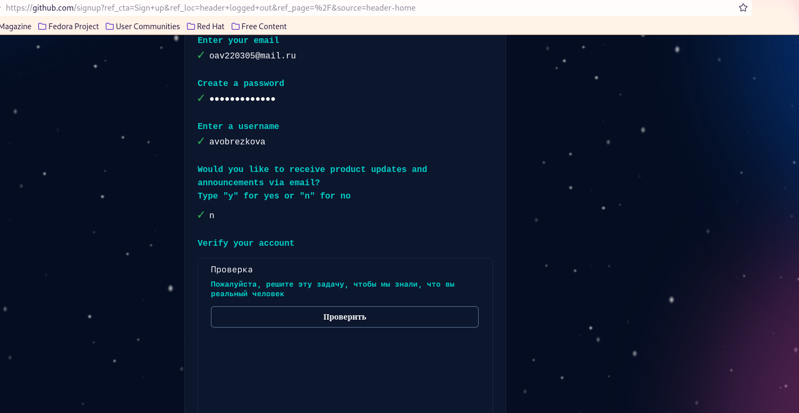{ #fig:001 width=70% }

## Базовая настройка git.

1.Создала предварительную конфигурацию git. (рис. [-@fig:002])

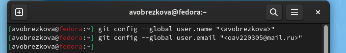{ #fig:002 width=70% }

2. Настроила utf-8 в выводе сообщений git. (рис. [-@fig:003])

{ #fig:003 width=70% }

3. Задала имя начальной ветки. (рис. [-@fig:004])

{ #fig:004 width=70% }

4. Параметр autocrlf. (рис. [-@fig:005])

{ #fig:005 width=70% }

5. Параметр safecrlf. (рис. [-@fig:006])

{ #fig:006 width=70% }

## Создание SSH ключа.

1. Генерирование ключей. (рис. [-@fig:007], рис. [-@fig:008])

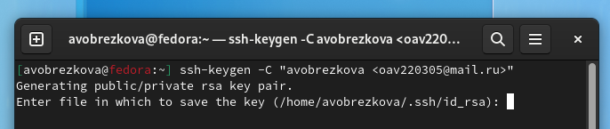{ #fig:007 width=70% }

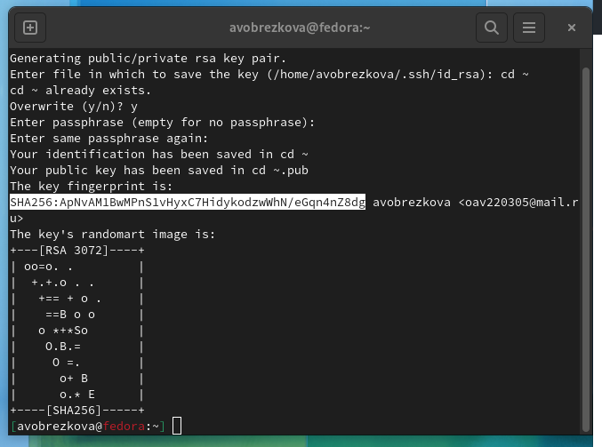{ #fig:008 width=70% }

2. С помощью команды cat скопировала из локальной консоли ключ в буфер обмена и вставила его в появившееся на сайте поле. Указала для ключа имя и создала его. (рис. [-@fig:009])

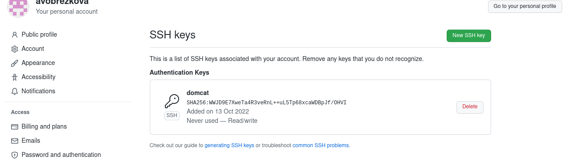{ #fig:009 width=70% }

## Создание рабочего пространства и репозитория курса на основе шаблона.

1. Создала католог для предмета "Архитектура компьютера". (рис. [-@fig:010])

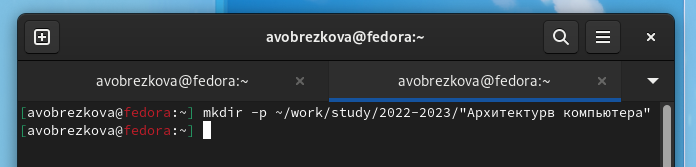{ #fig:010 width=70% }

## Создание репозитория курса на основе шаблона.

1.  Перешла на страницу репозитория с шаблоном курса, задала имя репозитория и создала его. (рис. [-@fig:011])

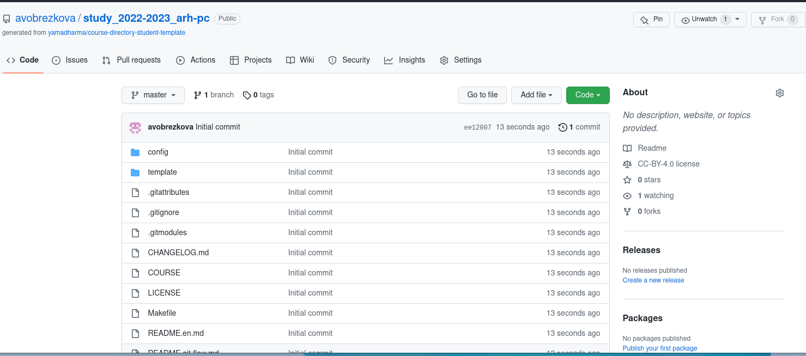{ #fig:011 width=70% }

2. Перешла в каталог курса. (рис. [-@fig:012])

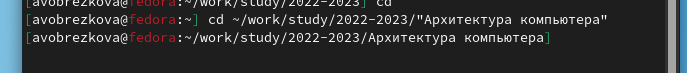{ #fig:012 width=70% }

3. Клонировала созданный репозиторий. (рис. [-@fig:013], рис. [-@fig:014])

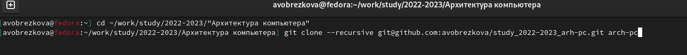{ #fig:013 width=70% }

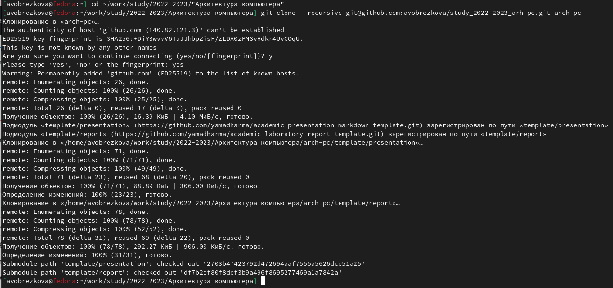{ #fig:014 width=70% }

## Настройка каталога курса.

1. Перешла в каталог курса и удалила лишние файлы. (рис. [-@fig:015])

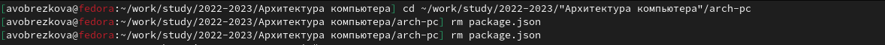{ #fig:015 width=70% }

2. Создала нобходимые каталоги. (рис. [-@fig:016]) 

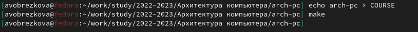{ #fig:016 width=70% }

3. Отправила файлы на сервис. (рис. [-@fig:017]), рис. [-@fig:018], рис. [-@fig:019])

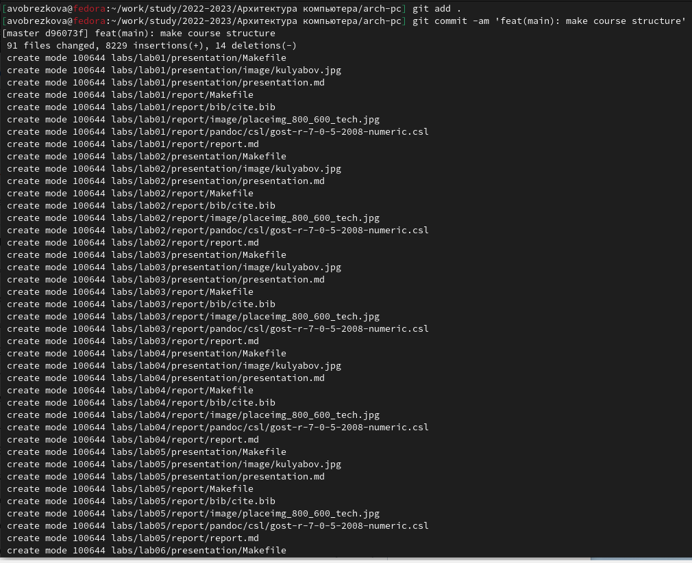{ #fig:017 width=70% }

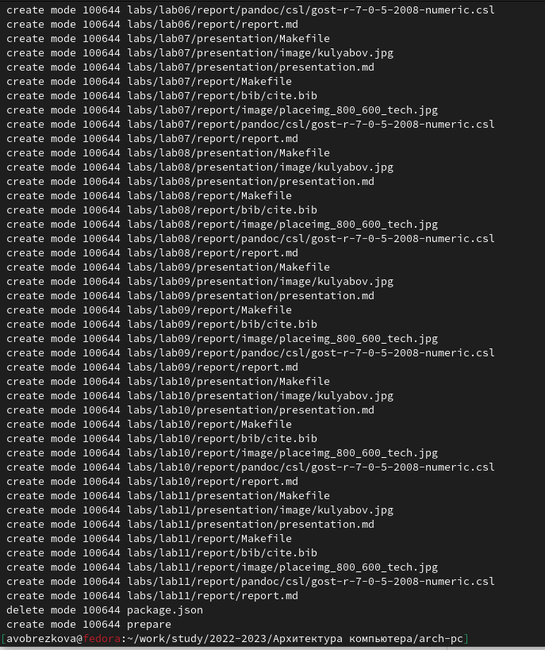{ #fig:018 width=70% }

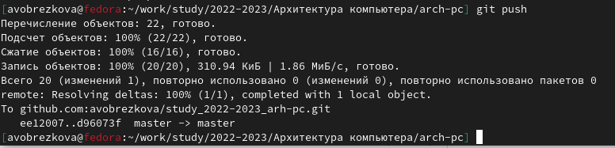{ #fig:019 width=70% }

# Задания для самостоятельной работы.

1. Создала отчет по выполнению лабораторной работы в соответствующем каталоге рабочего пространства. (рис. [-@fig:020], рис. [-@fig:021])

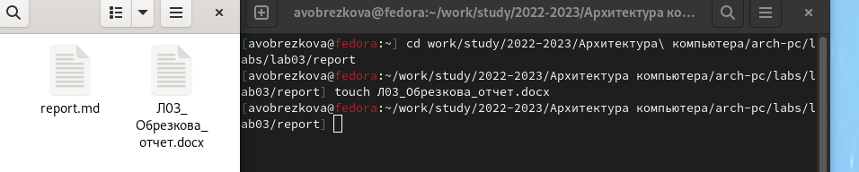{ #fig:020 width=70% }

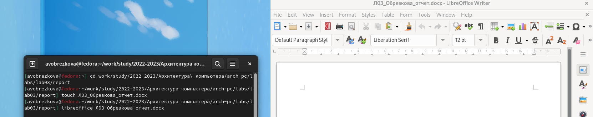{ #fig:021 width=70% }

2. Скопировала отчеты по выполнению предыдущих лабораторных работ в соответвующие каталоги. Отчеты выполнялись на виртуальной машине, поэтому я просто перенесла их из одного каталога в другой. (рис. [-@fig:022], рис. [-@fig:023])

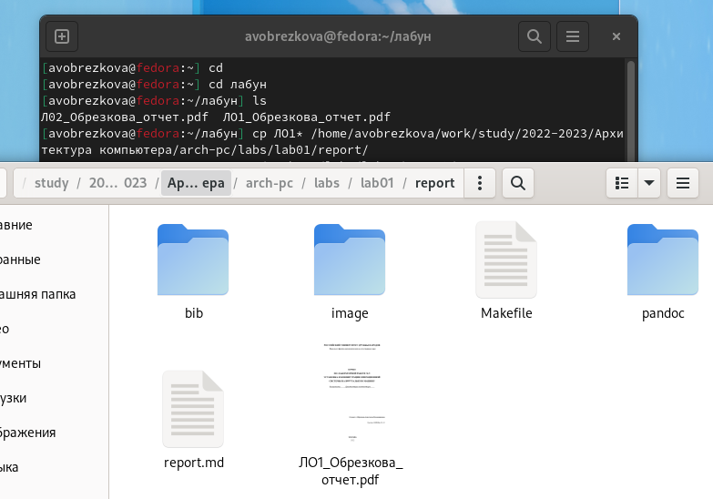{ #fig:022 width=70% }

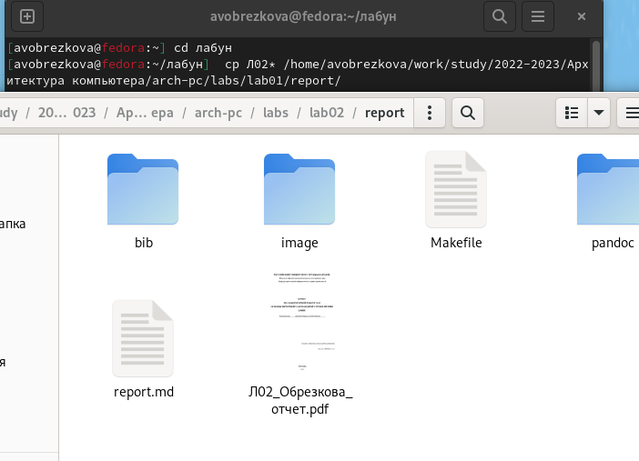{ #fig:023 width=70% }

3. Загрузка файлов на github. (рис. [-@fig:024], рис. [-@fig:025])

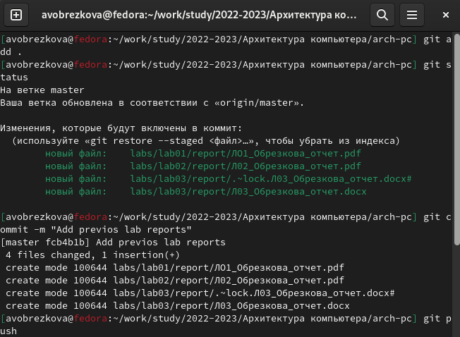{ #fig:024 width=70% }

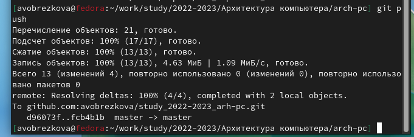{ #fig:025 width=70% }

Данные изменения можно проверить по ссылке:

[https://github.com/avobrezkova/study_2022-2023_arh-pc/tree/master/labs](https://github.com/avobrezkova/study_2022-2023_arh-pc/tree/master/labs)

# Выводы

Я ознакомилась с системой версий GIT. Создала репозиторий из шаблона сервиса GitHub и внесла в него необходимые изменения. Я освоила базовые команды утилита git.

# Список литературы{.unnumbered}

1. [https://esystem.rudn.ru/user/policy.php](https://esystem.rudn.ru/user/policy.php)

2. [https://github.com/yamadharma/academic-laboratory-report-template/tree/master/report](https://github.com/yamadharma/academic-laboratory-report-template/tree/master/report)

::: {#refs}
:::
