---
## Front matter
title: "ОТЧЕТ ПО ЛАБОРАТОРНОЙ РАБОТЕ №4"
subtitle: "Дисциплина: Архитектура компьютера"
author: "Обрезкова Анастасия Владимировна"

## Generic otions
lang: ru-RU
toc-title: "Содержание"

## Bibliography
bibliography: bib/cite.bib
csl: pandoc/csl/gost-r-7-0-5-2008-numeric.csl

## Pdf output format
toc: true # Table of contents
toc-depth: 2
lof: true # List of figures
lot: true # List of tables
fontsize: 12pt
linestretch: 1.5
papersize: a4
documentclass: scrreprt
## I18n polyglossia
polyglossia-lang:
  name: russian
  options:
	- spelling=modern
	- babelshorthands=true
polyglossia-otherlangs:
  name: english
## I18n babel
babel-lang: russian
babel-otherlangs: english
## Fonts
mainfont: PT Serif
romanfont: PT Serif
sansfont: PT Sans
monofont: PT Mono
mainfontoptions: Ligatures=TeX
romanfontoptions: Ligatures=TeX
sansfontoptions: Ligatures=TeX,Scale=MatchLowercase
monofontoptions: Scale=MatchLowercase,Scale=0.9
## Biblatex
biblatex: true
biblio-style: "gost-numeric"
biblatexoptions:
  - parentracker=true
  - backend=biber
  - hyperref=auto
  - language=auto
  - autolang=other*
  - citestyle=gost-numeric
## Pandoc-crossref LaTeX customization
figureTitle: "Рис."
tableTitle: "Таблица"
listingTitle: "Листинг"
lofTitle: "Список иллюстраций"
lotTitle: "Список таблиц"
lolTitle: "Листинги"
## Misc options
indent: true
header-includes:
  - \usepackage{indentfirst}
  - \usepackage{float} # keep figures where there are in the text
  - \floatplacement{figure}{H} # keep figures where there are in the text
---

# Цель работы

Освоить процедуры оформления отчетов с помощью легковесного языка разметки Markdown.

# Задание

Изучить легковесный язык разметки Markdown.

# Теоретическое введение

## 4.2.1. Базовые сведения о Markdown

Чтобы создать заголовок, используйте знак #.

Чтобы задать для текста полужирное начертание, заключите его в двойные
звездочки:

This text is **bold**.

Чтобы задать для текста курсивное начертание, заключите его в одинарные
звездочки:

This text is *italic*.

Чтобы задать для текста полужирное и курсивное начертание, заключите его
в тройные звездочки:

This is text is both ***bold and italic***.

Блоки цитирования создаются с помощью символа >:

> The drought had lasted now for ten million years, and the reign of
↪the terrible lizards had long since ended. Here on the Equator,
↪in the continent which would one day be known as Africa, the
↪battle for existence had reached a new climax of ferocity, and
↪the victor was not yet in sight. In this barren and desiccated
↪land, only the small or the swift or the fierce could flourish,
↪or even hope to survive.

Упорядоченный список можно отформатировать с помощью соответствую-
щих цифр:

1. First instruction
    1. Sub-instruction
    1. Sub-instruction
1. Second instruction

Чтобы вложить один список в другой, добавьте отступ для элементов дочер-
него списка:

1. First instruction
1. Second instruction
1. Third instruction

Неупорядоченный (маркированный) список можно отформатировать с помо-
щью звездочек или тире:

* List item 1
* List item 2
* List item 3

Чтобы вложить один список в другой, добавьте отступ для элементов дочер-
него списка:

- List item 1
- List item A
- List item B
- List item 2

Синтаксис Markdown для встроенной ссылки состоит из части [link text],
представляющей текст гиперссылки, и части (file-name.md) – URL-адреса или
имени файла, на который дается ссылка:

[link text](file-name.md)

или

[link text](http://example.com/ "Необязательная подсказка")

Markdown поддерживает как встраивание фрагментов кода в предложение,
так и их размещение между предложениями в виде отдельных огражденных
блоков. Огражденные блоки кода — это простой способ выделить синтаксис для
фрагментов кода. Общий формат огражденных блоков кода:

``` language
your code goes in here
```

## 4.2.2. Оформление формул в Markdown

Внутритекстовые формулы делаются аналогично формулам LaTeX. Например,
формула sin2 (𝑥) + cos2 (𝑥) = 1 запишется как

$\sin^2 (x) + \cos^2 (x) = 1$

Выключение формулы:

sin2 (𝑥) + cos2 (𝑥) = 1

## 4.2.3. Оформление изображений в Markdown

В Markdown вставить изображение в документ можно с помощью непосред-
ственного указания адреса изображения. 

Здесь:
• в квадратных скобках указывается подпись к изображению;
• в круглых скобках указывается URL-адрес или относительный путь изоб-
ражения, а также (необязательно) всплывающую подсказку, заключённую
в двойные или одиночные кавычки.
• в фигурных скобках указывается идентификатор изображения (#fig:fig1)
для ссылки на него по тексту и размер изображения относительно ширины
страницы (width=90%)

## 4.3. Техническое обеспечение

При выполнении лабораторной работы на своей технике необходимо устано-
вить следующее ПО:

• TeX Live (https://www.tug.org/texlive/) последней версии.

• Pandoc (https://pandoc.org/) версии v2.18

• Pandoc-crossref (https://github.com/lierdakil/pandoc-crossref/releases)
версии v0.3.13.0

# Выполнение лабораторной работы

## Установка TeX Live

1. На странице официального сайта TeX Live https://www.tug.org/texlive/acquire-netinstall.html скачала архив install-tl-unx.tar.gz. (рис. [-@fig:001])

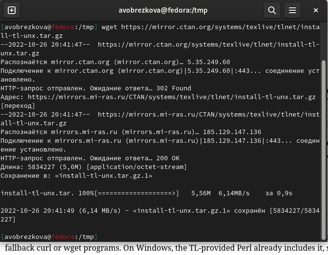{ #fig:001 width=70% }

2. Распаковала архив. (рис. [-@fig:002])

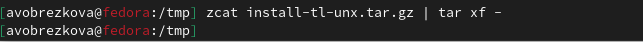{ #fig:002 width=70% }

3. Перешла в распакованную папку и запустила скрипт install-tl с root правами. (рис. [-@fig:003], рис. [-@fig:004])

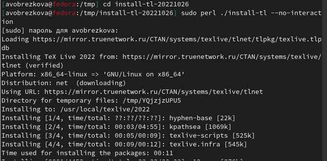{ #fig:003 width=70% }

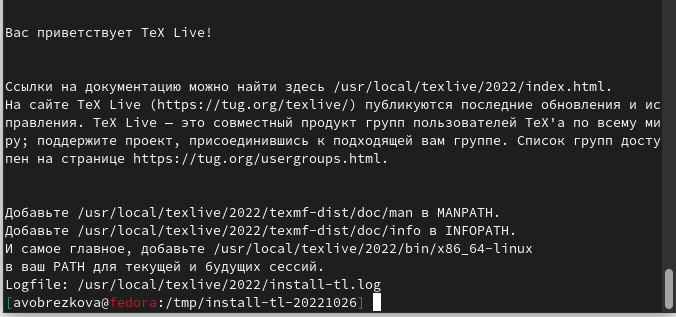{ #fig:004 width=70% }

4. Добавить /usr/local/texlive/2022/bin/x86_64-linux в мой PATH для текущей и будущих сессий. (рис. [-@fig:005])

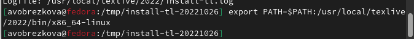{ #fig:005 width=70% }

## Установка Pandoc и pandoc-crossref

1. Скача архив с исходными файлами. (рис. [-@fig:006], рис. [-@fig:007])

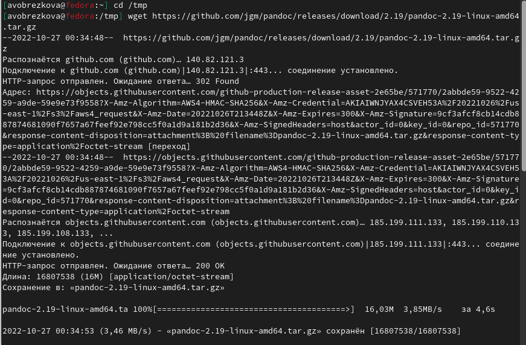{ #fig:006 width=70% }

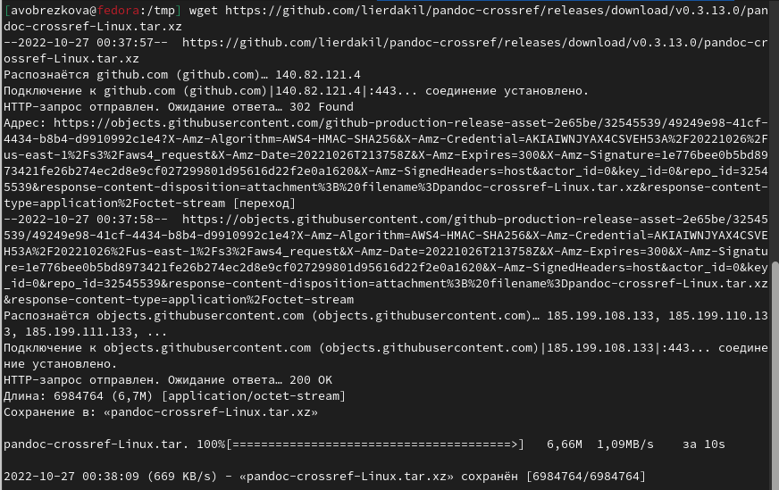{ #fig:007 width=70% }

2. Распаковала архивы. (рис. [-@fig:008])

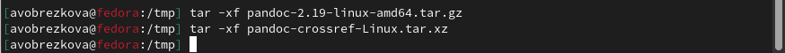{ #fig:008 width=70% }

3. Скопировать файлы pandoc и pandoc-crossref в каталог /usr/local/bin/ и проверила их наличие с помощью команды ls. (рис. [-@fig:009])

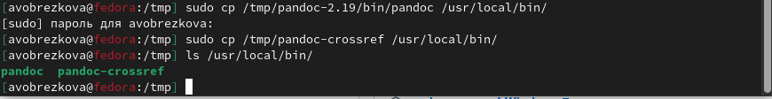{ #fig:009 width=70% }

## Выполнение лабораторной работы

1. Открыла терминал и перешла в каталог курса, сформированный при выполнении лабораторной работы №3. (рис. [-@fig:010])

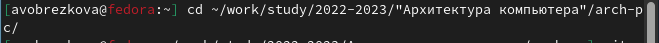{ #fig:010 width=70% }

2. Обновила локальный репозиторий. (рис. [-@fig:011])

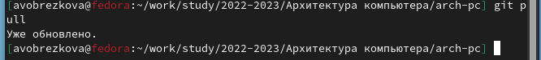{ #fig:011 width=70% }

3. Перешла в каталог с шаблоном ответа по лабораторной работе №4. (рис. [-@fig:012])

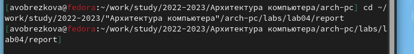{ #fig:012 width=70% }

4. Проведите компиляцию шаблона с использованием Makefile. (рис. [-@fig:013])

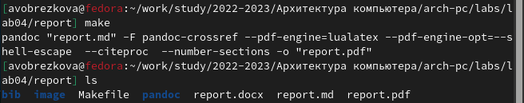{ #fig:013 width=70% }

5. Удалите полученный файлы с использованием Makefile. (рис. [-@fig:014])

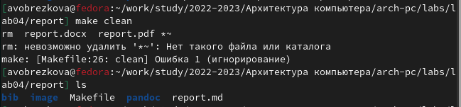{ #fig:014 width=70% }

6. Открыла файл report.md c помощью текстового редактора. (рис. [-@fig:015])

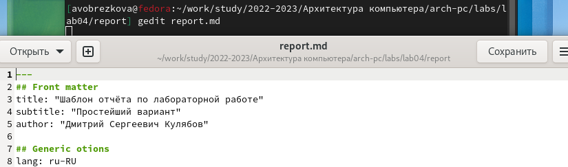{ #fig:015 width=70% }

7. Заполните отчет и скомпилируйте отчет с использованием Makefile. (рис. [-@fig:016])

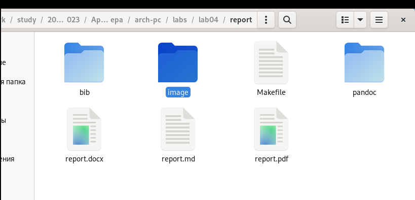{ #fig:016 width=70% }

8. Загрузила отчеты на github. (рис. [-@fig:017], рис. [-@fig:018])

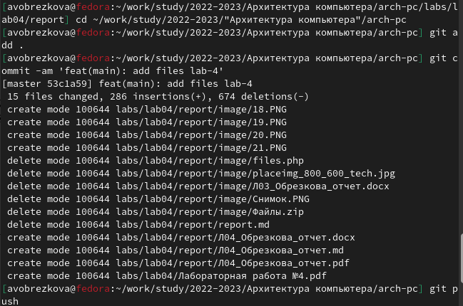{ #fig:017 width=70% }

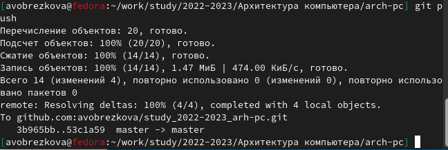{ #fig:018 width=70% }

## Самостоятельная работа

1. В соответствующем каталоге сделала отчёт по лабораторной работе № 3 в формате Markdown. (рис. [-@fig:019])

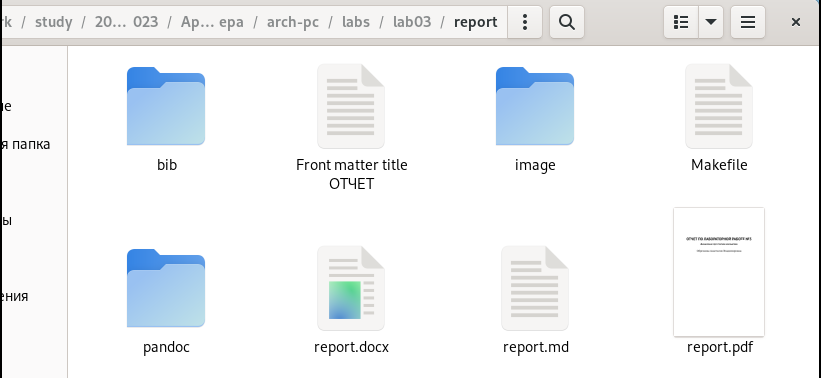{ #fig:019 width=70% }

2. Загрузила файлы на github. (рис. [-@fig:020], рис. [-@fig:021])

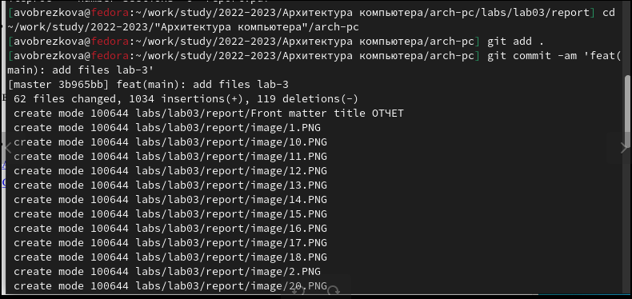{ #fig:020 width=70% }

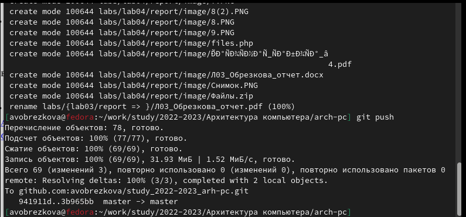{ #fig:021 width=70% }

# Выводы

Освоила процедуры оформления отчетов с помощью легковесной разметки Markdown.

# Список литературы{.unnumbered}

1. [https://github.com/avobrezkova/study_2022-2023_arh-pc/tree/master/labs](https://github.com/avobrezkova/study_2022-2023_arh-pc/tree/master/labs)


::: {#refs}
:::
