---
## Front matter
title: "ОТЧЕТ ПО ЛАБОРАТОРНОЙ РАБОТЕ №5"
subtitle: "Дисциплина: Архитектура компьютера"
author: "Обрезкова Анастасия Владимировна"

## Generic otions
lang: ru-RU
toc-title: "Содержание"

## Bibliography
bibliography: bib/cite.bib
csl: pandoc/csl/gost-r-7-0-5-2008-numeric.csl

## Pdf output format
toc: true # Table of contents
toc-depth: 2
lof: true # List of figures
lot: true # List of tables
fontsize: 12pt
linestretch: 1.5
papersize: a4
documentclass: scrreprt
## I18n polyglossia
polyglossia-lang:
  name: russian
  options:
	- spelling=modern
	- babelshorthands=true
polyglossia-otherlangs:
  name: english
## I18n babel
babel-lang: russian
babel-otherlangs: english
## Fonts
mainfont: PT Serif
romanfont: PT Serif
sansfont: PT Sans
monofont: PT Mono
mainfontoptions: Ligatures=TeX
romanfontoptions: Ligatures=TeX
sansfontoptions: Ligatures=TeX,Scale=MatchLowercase
monofontoptions: Scale=MatchLowercase,Scale=0.9
## Biblatex
biblatex: true
biblio-style: "gost-numeric"
biblatexoptions:
  - parentracker=true
  - backend=biber
  - hyperref=auto
  - language=auto
  - autolang=other*
  - citestyle=gost-numeric
## Pandoc-crossref LaTeX customization
figureTitle: "Рис."
tableTitle: "Таблица"
listingTitle: "Листинг"
lofTitle: "Список иллюстраций"
lotTitle: "Список таблиц"
lolTitle: "Листинги"
## Misc options
indent: true
header-includes:
  - \usepackage{indentfirst}
  - \usepackage{float} # keep figures where there are in the text
  - \floatplacement{figure}{H} # keep figures where there are in the text
---

# Цель работы
Освоить процедуру компиляции и сборки программ, написанных на ассемблере NASM.

# Задание

Изучить ассемблер NASM.

# Теоретическое введение

**Язык ассемблера** - машинноориентированный язык низкого уровня. Можно считать, что он больше других языков приближен к архитектуре ЭВМ и ее аппаратным возможностям, что позволяет получить к ним более полный доступ, нежели в языках высокого уровня. Для каждой архитектуры существует свой ассемблер и, соответственно, свой язык ассемблера.

**NASM** - это открытый проект ассемблера, версии которого доступны под различные операционные системы и который позволяет получать объектные файлы для этих систем.

# Выполнение лабораторной работы

## Программа Hello world!

1. Создала каталог для работы с программами на языке ассемблера NASM. (рис. [-@fig:001])

{ #fig:001 width=70% }

2. Перешла в созданный каталог. (рис. [-@fig:002])

{ #fig:002 width=70% }

3. Создала текстовый файл с именем hello.asm. (рис. [-@fig:003])

{ #fig:003 width=70% }

4. Открыла созданный файл с помощью текстового редактора gedit. (рис. [-@fig:004])

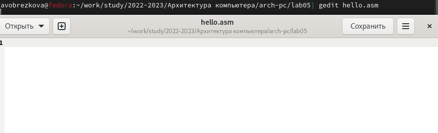{ #fig:004 width=70% }

5. Ввела в файл нужный текст. (рис. [-@fig:005])

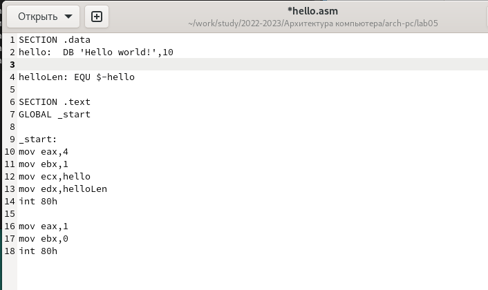{ #fig:005 width=70% }

## Транслятор NASM

1. Компиляция введенного текста программы "Hello world!". (рис. [-@fig:006])

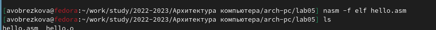{ #fig:006 width=70% }

## Расширенный синтаксис командной строки NASM

1. Скомпилировала исходный файл hello.asm в obj.o с помощью следующей команды и проверила, что файлы были созданы. (рис. [-@fig:007])

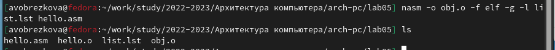{ #fig:007 width=70% }

## Компоновщик LD

1. Передала объектный файл на обработку компоновщику и проверила, что исполняемый файл hello был создан. (рис. [-@fig:008]) 

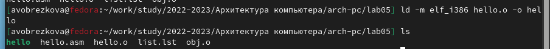{ #fig:008 width=70% }

2. выполнила следующую команду. (рис. [-@fig:009])

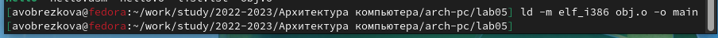{ #fig:009 width=70% }

3. Запустила на выполнение созданный исполняемый файл. (рис. [-@fig:010])

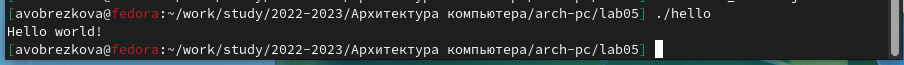{ #fig:010 width=70% }

## Задания для самостоятельной работы

1. Создала копию файла hello.asm с именем lab05.asm в каталоге ~/work/arch-pc/lab05. (рис. [-@fig:011])

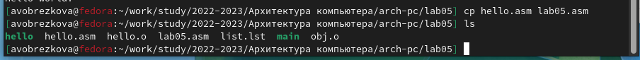{ #fig:011 width=70% }

2. Внесла изменения в текст программы в файле lab05.asm. (рис. [-@fig:012])

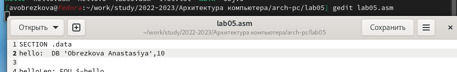{ #fig:012 width=70% }

3. Оттранслировала полученный текст программы в объектный файл , выполнила компановку объектного файла и запустила получившийся исполняемый файл. (рис. [-@fig:013])

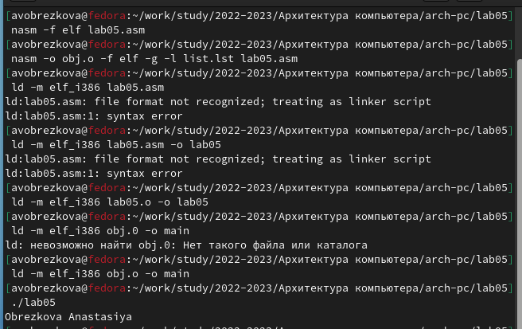{ #fig:013 width=70% }

4. Скопировала файлы в локальный репозиторий в нужный каталог. (рис. [-@fig:014], рис. [-@fig:015], рис. [-@fig:013])

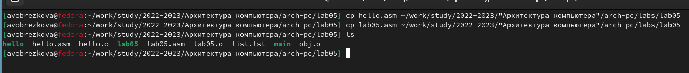{ #fig:014 width=70% }

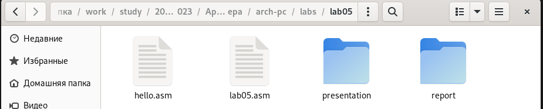{ #fig:015 width=70% }

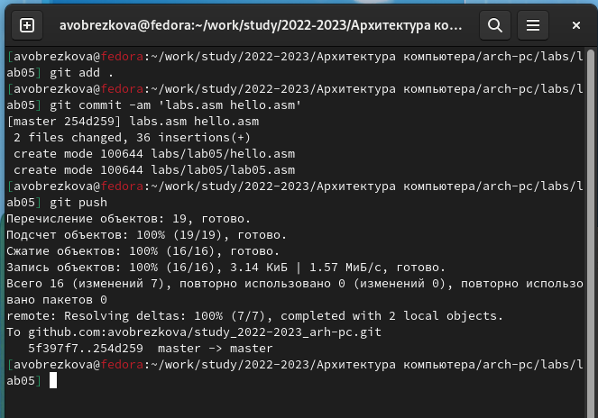{ #fig:016 width=70% }

Данные изменения можно проверить по ссылке: [https://github.com/avobrezkova/study_2022-2023_arh-pc/tree/master/labs/lab05/report](https://github.com/avobrezkova/study_2022-2023_arh-pc/tree/master/labs/lab05/report)

# Выводы

Освоила процедуры компиляции и сборки программ, написанных на ассемблере NASM.

# Список литературы{.unnumbered}

1. [https://esystem.rudn.ru/pluginfile.php/1584628/mod_resource/content/1/%D0%9B%D0%B0%D0%B1%D0%BE%D1%80%D0%B0%D1%82%D0%BE%D1%80%D0%BD%D0%B0%D1%8F%20%D1%80%D0%B0%D0%B1%D0%BE%D1%82%D0%B0%20%E2%84%965.pdf](https://esystem.rudn.ru/pluginfile.php/1584628/mod_resource/content/1/%D0%9B%D0%B0%D0%B1%D0%BE%D1%80%D0%B0%D1%82%D0%BE%D1%80%D0%BD%D0%B0%D1%8F%20%D1%80%D0%B0%D0%B1%D0%BE%D1%82%D0%B0%20%E2%84%965.pdf)

::: {#refs}
:::
