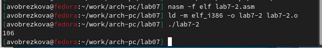
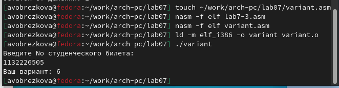
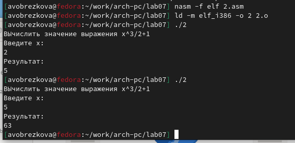

---
## Front matter
title: "ОТЧЕТ ПО ЛАБОРАТОРНОЙ РАБОТЕ №7"
subtitle: "Дисциплина: Архитектура компьютера"
author: "Обрезкова Анастасия Владимировна"

## Generic otions
lang: ru-RU
toc-title: "Содержание"

## Bibliography
bibliography: bib/cite.bib
csl: pandoc/csl/gost-r-7-0-5-2008-numeric.csl

## Pdf output format
toc: true # Table of contents
toc-depth: 2
lof: true # List of figures
lot: true # List of tables
fontsize: 12pt
linestretch: 1.5
papersize: a4
documentclass: scrreprt
## I18n polyglossia
polyglossia-lang:
  name: russian
  options:
	- spelling=modern
	- babelshorthands=true
polyglossia-otherlangs:
  name: english
## I18n babel
babel-lang: russian
babel-otherlangs: english
## Fonts
mainfont: PT Serif
romanfont: PT Serif
sansfont: PT Sans
monofont: PT Mono
mainfontoptions: Ligatures=TeX
romanfontoptions: Ligatures=TeX
sansfontoptions: Ligatures=TeX,Scale=MatchLowercase
monofontoptions: Scale=MatchLowercase,Scale=0.9
## Biblatex
biblatex: true
biblio-style: "gost-numeric"
biblatexoptions:
  - parentracker=true
  - backend=biber
  - hyperref=auto
  - language=auto
  - autolang=other*
  - citestyle=gost-numeric
## Pandoc-crossref LaTeX customization
figureTitle: "Рис."
tableTitle: "Таблица"
listingTitle: "Листинг"
lofTitle: "Список иллюстраций"
lotTitle: "Список таблиц"
lolTitle: "Листинги"
## Misc options
indent: true
header-includes:
  - \usepackage{indentfirst}
  - \usepackage{float} # keep figures where there are in the text
  - \floatplacement{figure}{H} # keep figures where there are in the text
---

# Цель работы

Освоение арифметических инструкций языка ассемблера NASM.

# Задание

Освоить арифметические инструкции языка ассемблера NASM.

# Теоретическое введение

Большинство инструкций на языке ассемблера требуют обработки операндов. Адрес операнда предоставляет место, где хранятся данные, подлежащие обработке. Это могут быть данные хранящиеся в регистре или в ячейке памяти.

ASCII – сокращение от American Standard Code for Information Interchange (Американский стандартный код для обмена информацией). Согласно стандарту ASCII каждый символ кодируется одним байтом.

Для выполнения лабораторных работ в файле in_out.asm реализованы подпрограммы для преобразования ASCII символов в числа и обратно. Это:

• iprint – вывод на экран чисел в формате ASCII, перед вызовом iprint в регистр eax необходимо записать выводимое число (mov eax,<int>).

• iprintLF – работает аналогично iprint, но при выводе на экран после числа добавляет к символ перевода строки.

• atoi – функция преобразует ascii-код символа в целое число и записает результат в регистр eax, перед вызовом atoi в регистр eax необходимо записать число (mov eax,<int>).

# Выполнение лабораторной работы

1. Создала каталог для программ лабораторной работы №7, перешла в него и создала файл lab7-1.asm. (рис. [-@fig:001])

{ #fig:001 width=70% }

2. Ввела в файл lab7-1 нужный текст программы из листинга 7.1., создала исполняемый файл и вывела результат. (рис. [-@fig:002]; рис. [-@fig:003])

{ #fig:002 width=70% }

{ #fig:003 width=70% }

3. Изменила текст программы и вместо символов, записала в регистры числа. (рис. [-@fig:004]; рис. [-@fig:005])

{ #fig:004 width=70% }

{ #fig:005 width=70% }

Этот символ не отображается при выводе на экран.

4. Создала файл lab7-2.asm в нужном каталоге, ввела в него текст программы из листинга 7.2. и вывела результат. (рис. [-@fig:006]; рис. [-@fig:007]; рис. [-@fig:008])

{ #fig:006 width=70% }

{ #fig:007 width=70% }

{ #fig:008 width=70% }

5. Изменила символы на числа, создала исполняемый файл и вывела результат. (рис. [-@fig:009]; рис. [-@fig:010])

{ #fig:009 width=70% }

{ #fig:010 width=70% }

6. Заменила функцию iprintLF на iprint и вывела результат. (рис. [-@fig:011]; рис. [-@fig:012])

{ #fig:011 width=70% }

{ #fig:012 width=70% }

Вывод функции iprintLF и iprint отличаются выводом результа, в одном варианте результат выводиться на отдельной строчке, а в другом нет.

## Выполнение арифметических операций в NASM.

1. Создала файл lab7-3.asm в нужном каталоге, ввела нужнй текст и вывела результат. (рис. [-@fig:013]; рис. [-@fig:014])

{ #fig:013 width=70% }

{ #fig:014 width=70% }

2. Изменила текст программы для вычисления выражения f(x)=(4*6+2)/5. (рис. [-@fig:015]; рис. [-@fig:016])

{ #fig:015 width=70% }

{ #fig:016 width=70% }

3. Изучила текст программы из листинга 7.4., ввела его в нужный файл и вывела результат. (рис. [-@fig:017]; рис. [-@fig:018])

{ #fig:017 width=70% }

{ #fig:018 width=70% }

## Ответы на вопросы

1. Какие строки листинга 7.4. отвечают за вывод на экран сообщения 'Ваш вариант:'?

mov eax, msg call sprintLF

2. Для чего используется следующие инструкции? nasm mov ecx, x mov edx, 80 call sread

Эти инструкции используются для ввода переменной X с клавиатуры и сохранения введенных данных.

3. Для чего используется инструкция "call atoi"?

Эта инструкция используется для преобразования кода переменной ASCII в число.

4. Какие строки листинга 7.4. отвечают за вычисления варианта?

mov ebx, 20 div ebx inc edx

5. В какой регистр записывается остаток от деления при выполнении инструкции "div edx"?

В регистре ebx.

6. Для чего используется инструкция "inc edx"?

Для увеличения значения edx на 1.

7. Какие строки листинга 7.4. отвечают за вывод на экран результата вычислений?

mov eax, edx call iprintLF

## Задания для самостоятельной работы

1. Я написала программу, которая будет решать выражение и выводить ответ при введенных X. Для решения мне попалось уравнение из 6 варианта: f(x)=x^3/2+1. (рис. [-@fig:019]; рис. [-@fig:020]; рис. [-@fig:021])

{ #fig:019 width=70% }

{ #fig:020 width=70% }

{ #fig:021 width=70% }

Данные изменения можно проверить по ссылке: [https://github.com/avobrezkova/study_2022-2023_arh-pc/tree/master/labs/lab07](https://github.com/avobrezkova/study_2022-2023_arh-pc/tree/master/labs/lab07)

# Выводы

Освоила арифметические инструкции языка ассемблера NASM.

# Список литературы{.unnumbered}

1. [https://esystem.rudn.ru/pluginfile.php/1584388/mod_resource/content/1/%D0%9B%D0%B0%D0%B1%D0%BE%D1%80%D0%B0%D1%82%D0%BE%D1%80%D0%BD%D0%B0%D1%8F%20%D1%80%D0%B0%D0%B1%D0%BE%D1%82%D0%B0%20%E2%84%967.pdf](https://esystem.rudn.ru/pluginfile.php/1584388/mod_resource/content/1/%D0%9B%D0%B0%D0%B1%D0%BE%D1%80%D0%B0%D1%82%D0%BE%D1%80%D0%BD%D0%B0%D1%8F%20%D1%80%D0%B0%D0%B1%D0%BE%D1%82%D0%B0%20%E2%84%967.pdf)

::: {#refs}
:::
