---
## Front matter
title: "ОТЧЕТ ПО ЛАБОРАТОРНОЙ РАБОТЕ №10"
subtitle: "Дисциплина: Архитектура компьютера"
author: "Обрезкова Анастасия Владимировна"

## Generic otions
lang: ru-RU
toc-title: "Содержание"

## Bibliography
bibliography: bib/cite.bib
csl: pandoc/csl/gost-r-7-0-5-2008-numeric.csl

## Pdf output format
toc: true # Table of contents
toc-depth: 2
lof: true # List of figures
lot: true # List of tables
fontsize: 12pt
linestretch: 1.5
papersize: a4
documentclass: scrreprt
## I18n polyglossia
polyglossia-lang:
  name: russian
  options:
	- spelling=modern
	- babelshorthands=true
polyglossia-otherlangs:
  name: english
## I18n babel
babel-lang: russian
babel-otherlangs: english
## Fonts
mainfont: PT Serif
romanfont: PT Serif
sansfont: PT Sans
monofont: PT Mono
mainfontoptions: Ligatures=TeX
romanfontoptions: Ligatures=TeX
sansfontoptions: Ligatures=TeX,Scale=MatchLowercase
monofontoptions: Scale=MatchLowercase,Scale=0.9
## Biblatex
biblatex: true
biblio-style: "gost-numeric"
biblatexoptions:
  - parentracker=true
  - backend=biber
  - hyperref=auto
  - language=auto
  - autolang=other*
  - citestyle=gost-numeric
## Pandoc-crossref LaTeX customization
figureTitle: "Рис."
tableTitle: "Таблица"
listingTitle: "Листинг"
lofTitle: "Список иллюстраций"
lotTitle: "Список таблиц"
lolTitle: "Листинги"
## Misc options
indent: true
header-includes:
  - \usepackage{indentfirst}
  - \usepackage{float} # keep figures where there are in the text
  - \floatplacement{figure}{H} # keep figures where there are in the text
---

# Цель работы

Приобретение навыков написания программ с использованием подпрограмм. Знакомство с методами отладки при помощи GDB и его основными возможностями.

# Задание

1. Приобрести навыки написания программ с использованием подпрограмм.

2. Ознакомится с методами отладки при помощи GDB и его основными возможностями.
 
# Теоретическое введение

Отладка — это процесс поиска и исправления ошибок в программе. В общем случае его можно разделить на четыре этапа:

• обнаружение ошибки;

• поиск её местонахождения;

• определение причины ошибки;

• исправление ошибки.

Наиболее часто применяют следующие методы отладки:

• создание точек контроля значений на входе и выходе участка программы (например, вывод промежуточных значений на экран — так называемые диагностические сообщения);

• использование специальных программ-отладчиков.

Отладчики позволяют управлять ходом выполнения программы, контролировать и изменять данные. Это помогает быстрее найти место ошибки в программе и ускорить её исправление. Наиболее популярные способы работы с отладчиком — это использование точек останова и выполнение программы по шагам.

GDB (GNU Debugger — отладчик проекта GNU) [1] работает на многих UNIX-подобных системах и умеет производить отладку многих языков программирования. GDB предлагает обширные средства для слежения и контроля за выполнением компьютерных программ. Отладчик не содержит собственного графического пользовательского интерфейса и использует стандартный текстовый интерфейс консоли. Однако для GDB существует несколько сторонних графических надстроек, а кроме того, некоторые интегрированные среды разработки используют его в качестве базовой подсистемы отладки.

# Выполнение лабораторной работы

## Реализация подпрограмм в NASM

1. Создала каталог для программ лабораторной работы №10, перешла в него и создала файл lab9=10-1.asm. (рис. [-@fig:001])

{ #fig:001 width=70% }

2. Ввела в файл lab10-1 нужный текст программы из листинга 10.1., создала исполняемый файл и вывела результат. (рис. [-@fig:002]; рис. [-@fig:003])

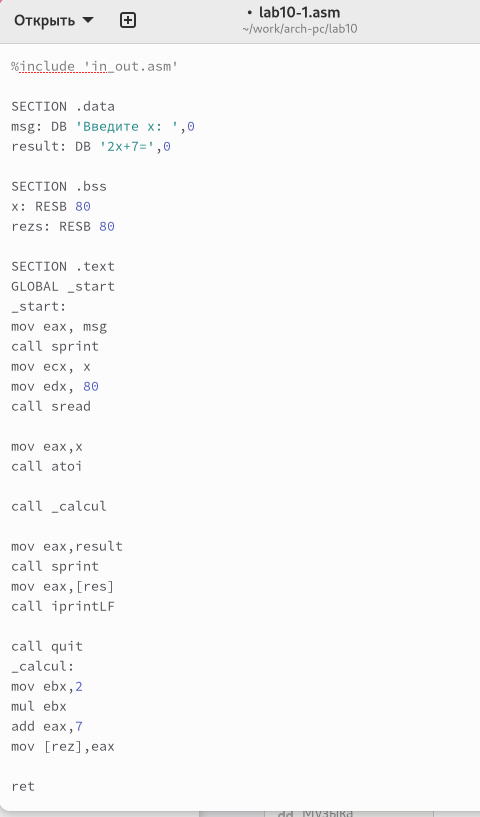{ #fig:002 width=70% }

{ #fig:003 width=70% }

3. Изменила текст программы, для вычисления выражения f(g(x)), где x вводится с клавиатуры, f(x)=2x+7, g(x)=3x-1. (рис. [-@fig:004]; рис. [-@fig:005]; рис. [-@fig:006])

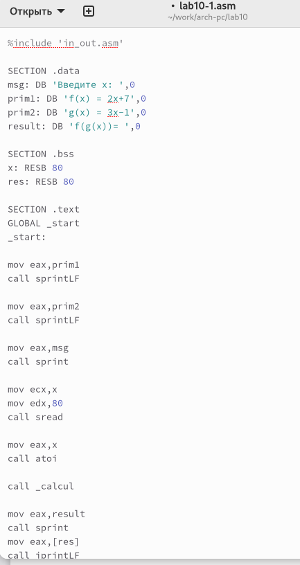{ #fig:004 width=70% }

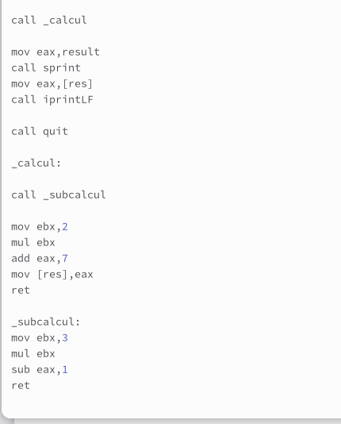{ #fig:005 width=70% }

{ #fig:006 width=70% }

## Отладка программ с помощью GDB

1. Создала файл lab10-2.asm с текстом программы из листинга 10.2. Получила исполняемый файл для работы с GDB и загрузила его в gdb.(рис. [-@fig:007]; рис. [-@fig:008])

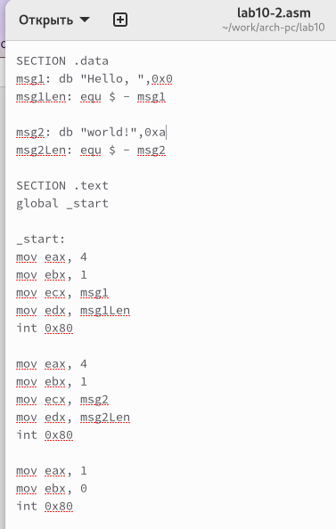{ #fig:007 width=70% }

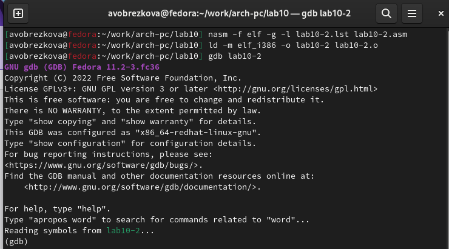{ #fig:008 width=70% }

2. Проверьте работу программы, запустив ее в оболочке GDB с помощью команды run. (рис. [-@fig:009])

{ #fig:009 width=70% }

3. Установила брейкпоинт на метку _start, с которой начинается выполнение любой ассемблерной программы, и
запустила её. (рис. [-@fig:010])

{ #fig:010 width=70% }

4. Посмотрела дисассимилированный код программы с помощью команды disassemble начиная с метки _start. (рис. [-@fig:011])

{ #fig:011 width=70% }

5. Переключидась на отображение команд с Intel’овским синтаксисом, введя команду set disassembly-flavor intel. (рис. [-@fig:012])

{ #fig:012 width=70% }

Различия отображения синтаксиса машинных команд в режимах ATT и Intel: в АТТ перед адресом регистра ставится $, а перед названием регистра %, сначала записывается адрес, а потом - регистр. В Intel сначала регистр, а потом адрес, и перед ними ничего не ставится.

6. Включите режим псевдографики для более удобного анализа программы. (рис. [-@fig:013])

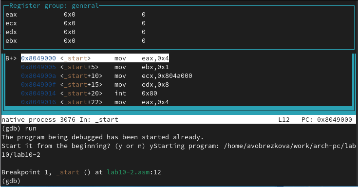{ #fig:013 width=70% }

## Добавление точек останова

1. Ранее я установила точку останова по имени метки (_start). Проверила это с помощью команды info breakpoints (кратко i b). (рис. [-@fig:014])

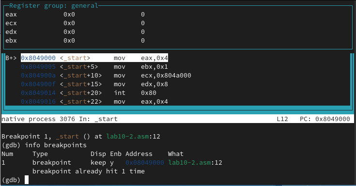{ #fig:014 width=70% }

2. Установила еще одну точку останова по адресу инструкции.. (рис. [-@fig:015])

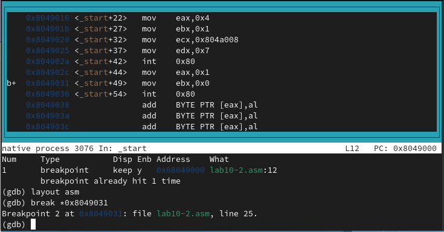{ #fig:015 width=70% }

3. Посмотрела информацию о всех установленных точках останова. (рис. [-@fig:016])

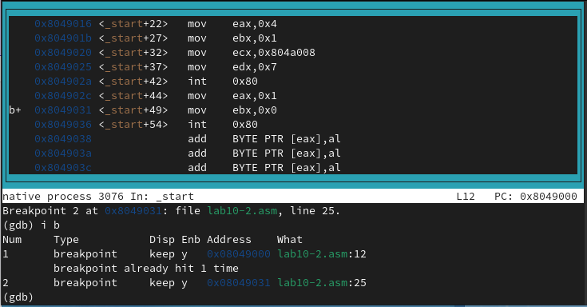{ #fig:016 width=70% }

## Работа с данными программы в GDB

1. Посмотрела содержимое регистров с помощью команды info registers. (рис. [-@fig:017])

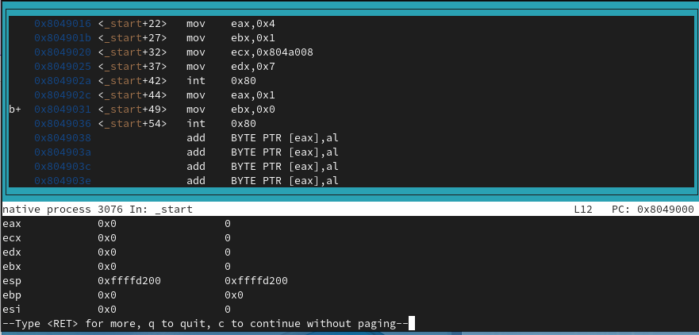{ #fig:017 width=70% }

2. Посмотрела значение переменной msg1. (рис. [-@fig:018])

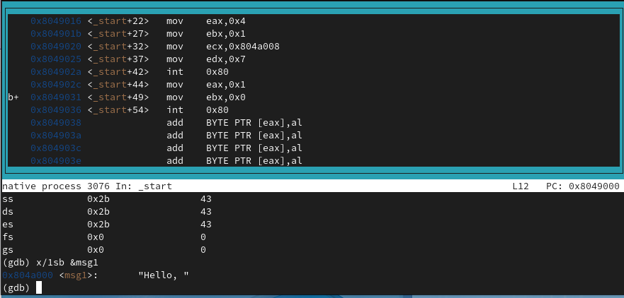{ #fig:018 width=70% }

3. Изменила первый символ переменной msg1. (рис. [-@fig:019])

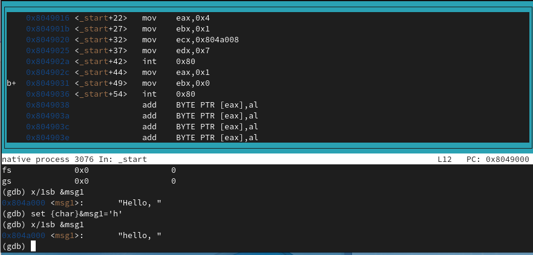{ #fig:019 width=70% }

4. Посмотрела значение переменной msg2 по адресу и изменила первый символ переменной msg1. (рис. [-@fig:020])

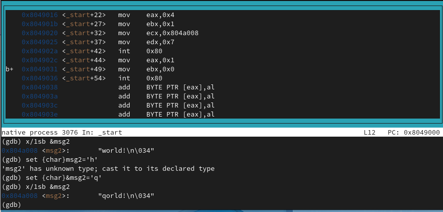{ #fig:020 width=70% }

5. Посмотрела значения регистров с помощью команды print /F <val>. (рис. [-@fig:021])

{ #fig:021 width=70% }

6. С помощью команды set изменила значение регистра ebx. (рис. [-@fig:022])

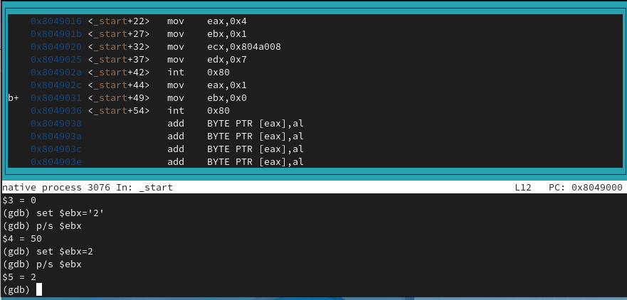{ #fig:022 width=70% }

## Обработка аргументов командной строки в GDB

1. Скопировала файл lab9-2.asm, созданный при выполнении лабораторной работы No9, с программой выводящей на экран аргументы командной строки (Листинг 9.2) в файл с именем lab10-3.asm. (рис. [-@fig:023])

{ #fig:023 width=70% }

2. Создала исполняемый файл. (рис. [-@fig:024])

{ #fig:024 width=70% }

3. Использовала ключ --args. Загрузила исполняемый файл в отладчик, указав аргументы. (рис. [-@fig:025])

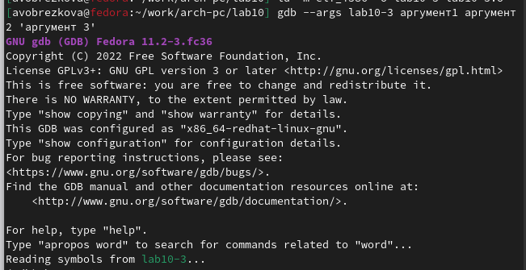{ #fig:025 width=70% }

4. Установила точку останова перед первой инструкцией в программе и запустила ее. (рис. [-@fig:026])

{ #fig:026 width=70% }

5. Адрес вершины стека храниться в регистре esp и по этому адресу располагается число равное количеству аргументов командной строки (включая имя программы). (рис. [-@fig:027])

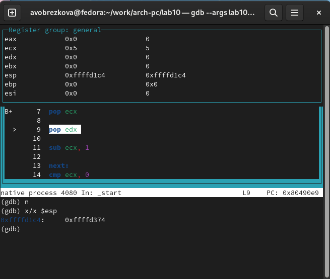{ #fig:027 width=70% }

6. Посмотрела остальные позиции стека. (рис. [-@fig:028]; рис. [-@fig:029])

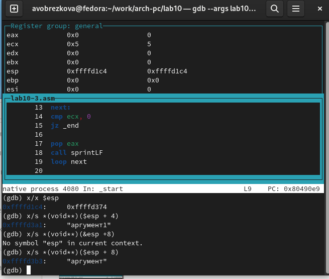{ #fig:028 width=70% }

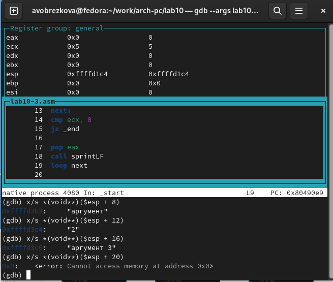{ #fig:029 width=70% }

Шаг изменения адреса равен 4 ([esp+4], [esp+8], [esp+12] и т.д.), потому что в теле цикла 4 строки кода.

## Задания для самостоятельной работы

1. Преобразовала программу из лабораторной работы No9 (Задание No1 для самостоятельной работы), реализовав вычисление значения функции f(x) как подпрограмму. (рис. [-@fig:030]; рис. [-@fig:031]; рис. [-@fig:032])

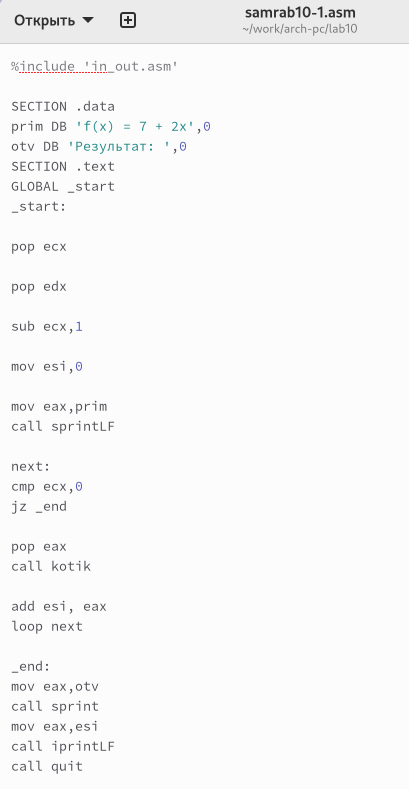{ #fig:030 width=70% }

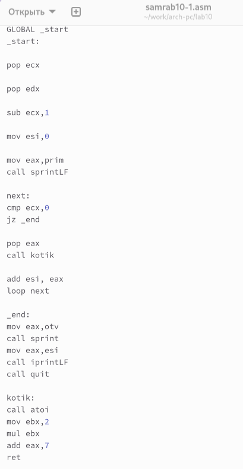{ #fig:031 width=70% }

{ #fig:032 width=70% }

2. В листинге 10.3 приведена программа вычисления выражения (3 + 2) ∗ 4 + 5. При запуске данная программа дает неверный результат. Проверила это с помощью отладчика GDB, анализируя изменения значений регистров, определила ошибку и исправила ее. (рис. [-@fig:033]; рис. [-@fig:034]; рис. [-@fig:035]; рис. [-@fig:036])

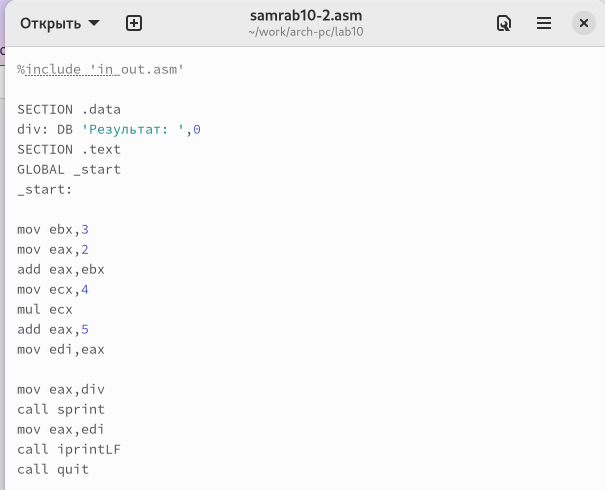{ #fig:033 width=70% }

{ #fig:034 width=70% }

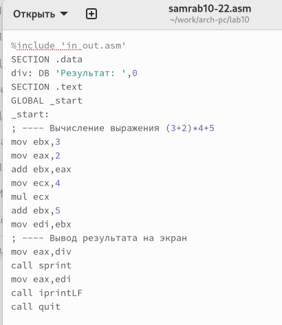{ #fig:035 width=70% }

{ #fig:036 width=70% }

Данные изменения можно проверить по ссылке: [https://github.com/avobrezkova/study_2022-2023_arh-pc/tree/master/labs/lab10](https://github.com/avobrezkova/study_2022-2023_arh-pc/tree/master/labs/lab10)

# Выводы

Приобрела навыки написания программ с использованием подпрограмм. Ознакомилась с методами отладки при помощи GDB и его основными возможностями.

# Список литературы{.unnumbered}

1. [https://esystem.rudn.ru/pluginfile.php/1584394/mod_resource/content/1/%D0%9B%D0%B0%D0%B1%D0%BE%D1%80%D0%B0%D1%82%D0%BE%D1%80%D0%BD%D0%B0%D1%8F%20%D1%80%D0%B0%D0%B1%D0%BE%D1%82%D0%B0%20%E2%84%9610.pdf](https://esystem.rudn.ru/pluginfile.php/1584394/mod_resource/content/1/%D0%9B%D0%B0%D0%B1%D0%BE%D1%80%D0%B0%D1%82%D0%BE%D1%80%D0%BD%D0%B0%D1%8F%20%D1%80%D0%B0%D0%B1%D0%BE%D1%82%D0%B0%20%E2%84%9610.pdf)

::: {#refs}
:::
