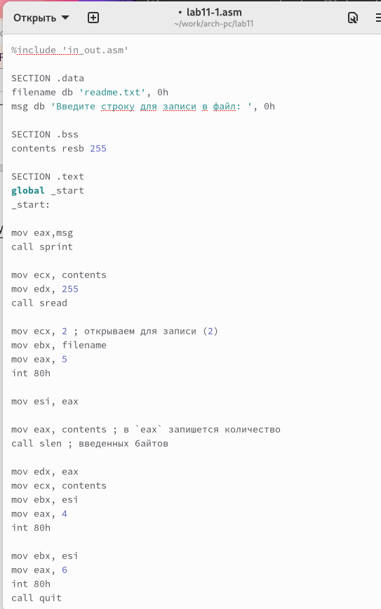
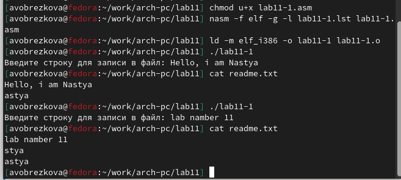
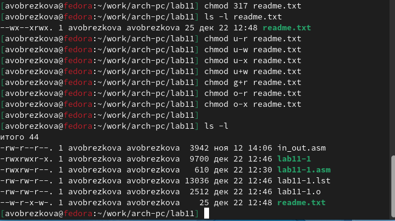

---
## Front matter
title: "ОТЧЕТ ПО ЛАБОРАТОРНОЙ РАБОТЕ №10"
subtitle: "Дисциплина: Архитектура компьютера"
author: "Обрезкова Анастасия Владимировна"

## Generic otions
lang: ru-RU
toc-title: "Содержание"

## Bibliography
bibliography: bib/cite.bib
csl: pandoc/csl/gost-r-7-0-5-2008-numeric.csl

## Pdf output format
toc: true # Table of contents
toc-depth: 2
lof: true # List of figures
lot: true # List of tables
fontsize: 12pt
linestretch: 1.5
papersize: a4
documentclass: scrreprt
## I18n polyglossia
polyglossia-lang:
  name: russian
  options:
	- spelling=modern
	- babelshorthands=true
polyglossia-otherlangs:
  name: english
## I18n babel
babel-lang: russian
babel-otherlangs: english
## Fonts
mainfont: PT Serif
romanfont: PT Serif
sansfont: PT Sans
monofont: PT Mono
mainfontoptions: Ligatures=TeX
romanfontoptions: Ligatures=TeX
sansfontoptions: Ligatures=TeX,Scale=MatchLowercase
monofontoptions: Scale=MatchLowercase,Scale=0.9
## Biblatex
biblatex: true
biblio-style: "gost-numeric"
biblatexoptions:
  - parentracker=true
  - backend=biber
  - hyperref=auto
  - language=auto
  - autolang=other*
  - citestyle=gost-numeric
## Pandoc-crossref LaTeX customization
figureTitle: "Рис."
tableTitle: "Таблица"
listingTitle: "Листинг"
lofTitle: "Список иллюстраций"
lotTitle: "Список таблиц"
lolTitle: "Листинги"
## Misc options
indent: true
header-includes:
  - \usepackage{indentfirst}
  - \usepackage{float} # keep figures where there are in the text
  - \floatplacement{figure}{H} # keep figures where there are in the text
---

# Цель работы

Приобретение навыков написания программ для работы с файлами.

# Задание

Приобрести навыки написания программ для будущей работы с файлами.

# Теоретическое введение

ОС GNU/Linux является многопользовательской операционной системой. И для обеспечения защиты данных одного пользователя от действий других пользователей существуют специальные механизмы разграничения доступа к файлам. Кроме ограничения доступа, данный механизм позволяет разрешить другим пользователям доступ данным для совместной работы.

Права доступа определяют набор действий (чтение, запись, выполнение), разрешённых для выполнения пользователям системы над файлами. Для каждого файла пользователь может входить в одну из трех групп: владелец, член группы владельца, все остальные. 

Набор прав доступа задается тройками битов и состоит из прав на чтение, запись и исполнение файла. В символьном представлении он имеет вид строк rwx, где вместо любого символа может стоять дефис.

В операционной системе Linux существуют различные методы управления файлами, например, такие как создание и открытие файла, только для чтения или для чтения и записи, добавления в существующий файл, закрытия и удаления файла, предоставление прав доступа. Обработка файлов в операционной системе Linux осуществляется за счет использования определенных системных вызовов. Для корректной работы и доступа к файлу при его открытии или создании, файлу присваивается уникальный номер (16-битное целое число) – дескриптор файла.

Для создания и открытия файла служит системный вызов sys_creat, который использует следующие аргументы: права доступа к файлу в регистре ECX, имя файла в EBX и номер системного вызова sys_creat (8) в EAX.

Для открытия существующего файла служит системный вызов sys_open, который использует следующие аргументы: права доступа к файлу в регистре EDX, режим доступа к файлу в регистр ECX, имя файла в EBX и номер системного вызова sys_open (5) в EAX.

Для записи в файл служит системный вызов sys_write, который использует следующие аргументы: количество байтов для записи в регистре EDX, строку содержимого для записи ECX, файловый дескриптор в EBX и номер системного вызова sys_write (4) в EAX.

Для чтения данных из файла служит системный вызов sys_read, который использует следующие аргументы: количество байтов для чтения в регистре EDX, адрес в памяти для записи прочитанных данных в ECX, файловый дескриптор в EBX и номер системного вызова sys_read (3) в EAX. Как и для записи, прежде чем читать из файла, его необходимо открыть, что позволит получить дескриптор файла.

Для правильного закрытия файла служит системный вызов sys_close, который использует один аргумент – дескриптор файла в регистре EBX. После вызова ядра происходит удаление дескриптора файла, а в случае ошибки, системный вызов возвращает код ошибки в регистр EAX.

Для изменения содержимого файла служит системный вызов sys_lseek, который использует следующие аргументы: исходная позиция для смещения EDX, значение смещения в байтах в ECX, файловый дескриптор в EBX и номер системного вызова sys_lseek (19) в EAX.

Удаление файла осуществляется системным вызовом sys_unlink, который использует один аргумент – имя файла в регистре EBX.

# Выполнение лабораторной работы

1. Создала каталог для программ лабораторной работы №11, перешла в него и создала файл lab11-1.asm и readme.txt. (рис. [-@fig:001])

{ #fig:001 width=70% }

2. Ввела в файл lab11-1 нужный текст программы из листинга 11.1., создала исполняемый файл и вывела результат. (рис. [-@fig:002]; рис. [-@fig:003])

{ #fig:002 width=70% }

{ #fig:003 width=70% }

3. С помощью команды chmod изменила права доступа к исполняемому файлу lab11-1, запретив его выполнение. Результатом работы является отказ в доступе, так как я запретила запускать программу для владельца, то есть для себя. (рис. [-@fig:004])

{ #fig:004 width=70% }

4. С помощью команды chmod изменила права доступа к файлу lab11-1.asm с исходным текстом программы, добавив права на исполнение. Программа заработала, так как файл был со всеми разрешениями. В прошлый раз я запрещала выполняться уже готовой программе, а это фактически новая программа, обладающая новыми разрешениями, поэтому она запустилась. [-@fig:005])

{ #fig:005 width=70% }

5. Предоставила права доступа к файлу readme.txt в соответствии с вариантом в таблице 11.4, вариант 6. Проверила правильность выполнения с помощью команды ls -l (рис. [-@fig:006])

{ #fig:006 width=70% }

## Задания для самостоятельной работы

1. Написала программу работающую по следующему алгоритму:

• Вывод приглашения “Как Вас зовут?”

• ввести с клавиатуры свои фамилию и имя

• создать файл с именем name.txt

• записать в файл сообщение “Меня зовут”

• дописать в файл строку введенную с клавиатуры

• закрыть файл

Создала исполняемый файл и проверила его работу. Проверила наличие файла и его содержимое с помощью команд ls и cat. (рис. [-@fig:007]; рис. [-@fig:008]; рис. [-@fig:009])

{ #fig:007 width=70% }

{ #fig:008 width=70% }

{ #fig:009 width=70% }

Данные изменения можно проверить по ссылке: [https://github.com/avobrezkova/study_2022-2023_arh-pc/tree/master/labs/lab11](https://github.com/avobrezkova/study_2022-2023_arh-pc/tree/master/labs/lab11)

# Выводы

Приобрела навыки написания программ для работы с файлами.

# Список литературы{.unnumbered}

1. [https://esystem.rudn.ru/pluginfile.php/1584395/mod_resource/content/1/%D0%9B%D0%B0%D0%B1%D0%BE%D1%80%D0%B0%D1%82%D0%BE%D1%80%D0%BD%D0%B0%D1%8F%20%D1%80%D0%B0%D0%B1%D0%BE%D1%82%D0%B0%20%E2%84%9611.pdf](https://esystem.rudn.ru/pluginfile.php/1584395/mod_resource/content/1/%D0%9B%D0%B0%D0%B1%D0%BE%D1%80%D0%B0%D1%82%D0%BE%D1%80%D0%BD%D0%B0%D1%8F%20%D1%80%D0%B0%D0%B1%D0%BE%D1%82%D0%B0%20%E2%84%9611.pdf)

::: {#refs}
:::
